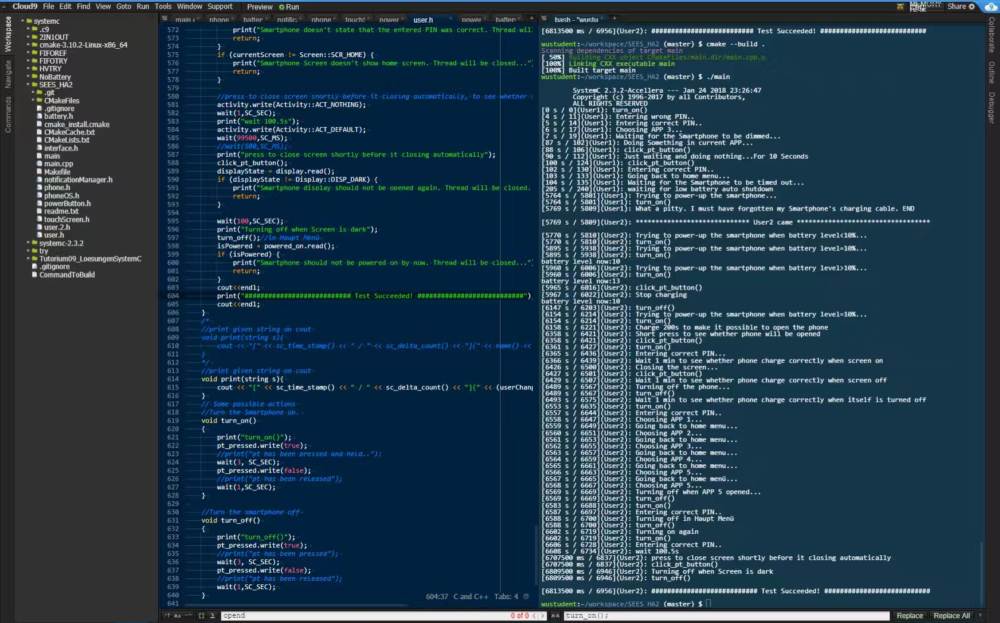

# MySystemCProj
A SystemC project, which implements a system design of a dumbphone.

Contributors: Yong Wu, Daniel Sharkov, Hongyu Zhao

---
# Introduction


---
# How to run?
You can use [DockerCpp](https://github.com/wustudent/DockerCpp) for setting up the SystemC compiling environment. 

Once you have started the docker container, clone this repo and follow these steps:

```bash
git clone https://github.com/wustudent/MySystemCProj.git
cd MySystemCProj
cmake -DCMAKE_CXX_STANDARD=11 -DCMAKE_BUILD_TYPE=Debug && cmake --build .
./main
```


